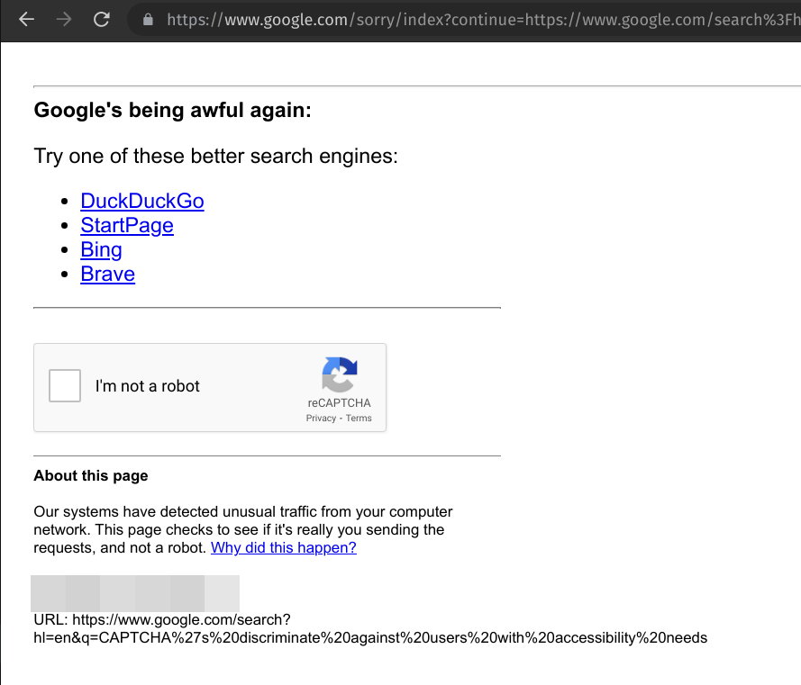

# google-to-ddg

When Google decides to CAPTCHA block you, show buttons that direct you to alternative search engines.

## Why?

I have my default search engine set to DuckDuckGo, but sometimes when I'm in a rush, I'll just try and go straight to Google, using the Google [bang](https://duckduckgo.com/bang).

I frequently get CAPTCHA's on Google, and as I refuse to solve them, it means I have to retype my search query again into DuckDuckGo, or another search engine.

This extension puts links to some better search engines at the top of the Google CAPTCHA page.

## How to install?
Google has made it very hard to install extensions that are not in their proprietary Chrome Store.

1. So you need to [download](https://github.com/markwylde/google-to-ddg/archive/refs/heads/master.zip) this project and extract it into a folder somewhere on your computer.

2. Then in your browser, goto `chrome://extensions/`.

3. Click "Developer Mode" to enable it

4. Click "Load unpacked".

5. Navigate to the directory you unzipped this project into

Done! Now anytime Google decides to show you a CAPTCHA, you can select a better search engine to go to

Of course, if you really just need a Google search, the CAPTCHA will work as normal.
